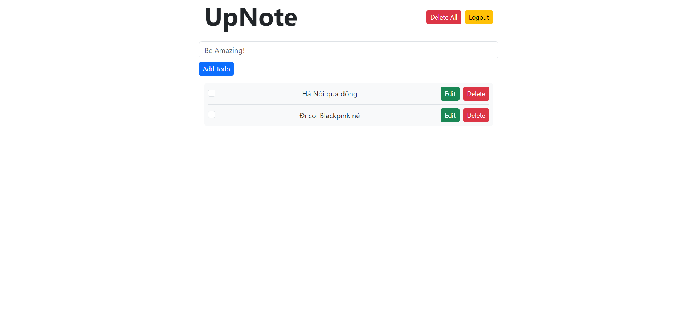
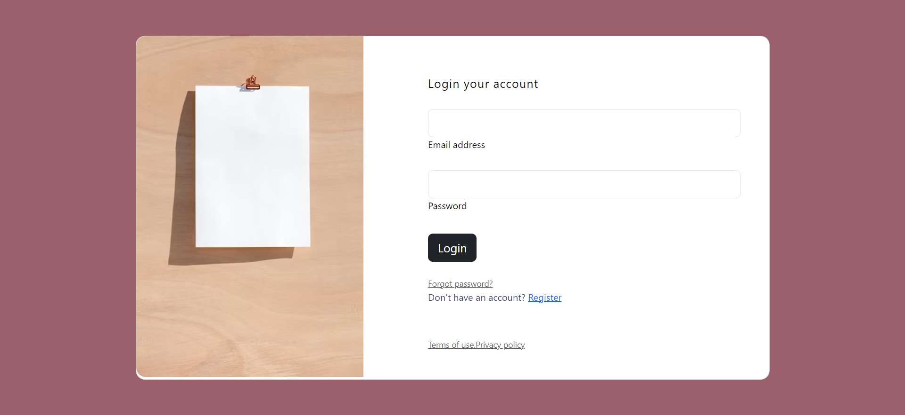
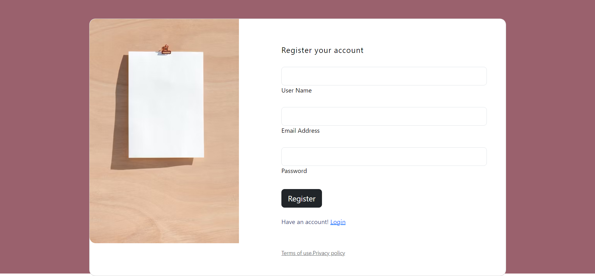
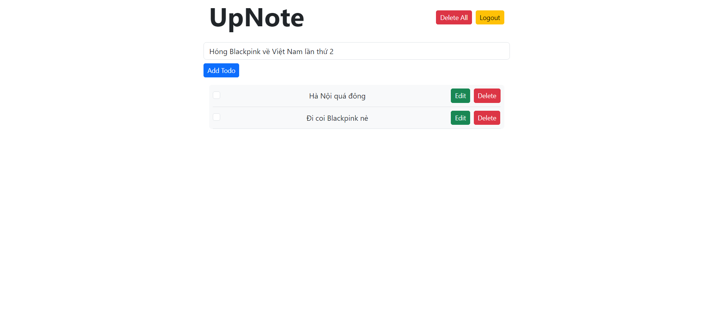
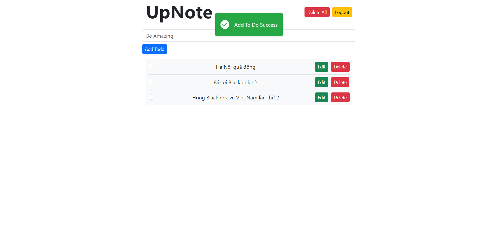
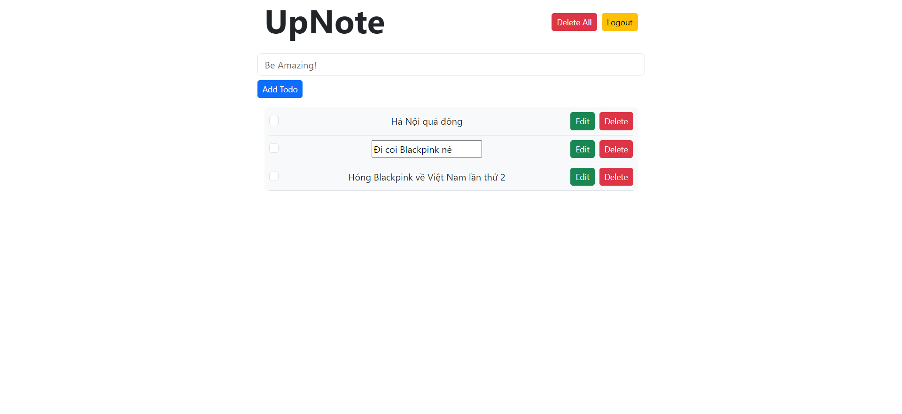
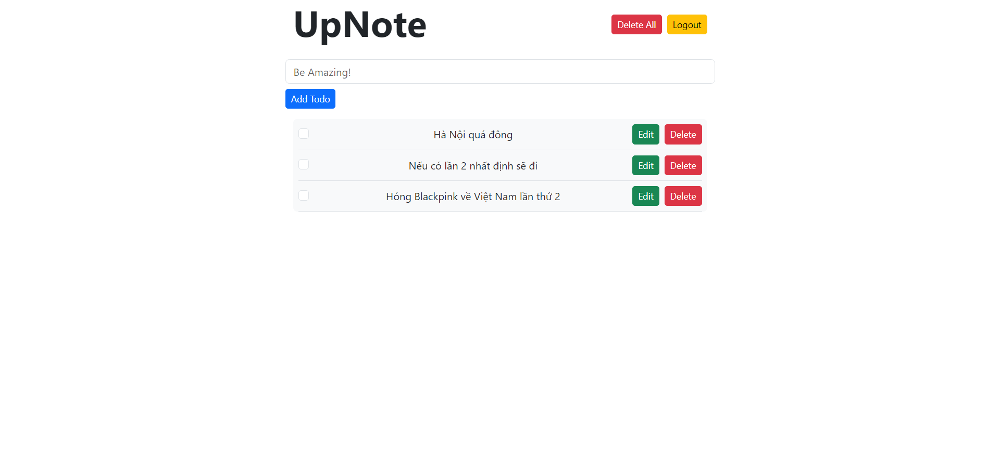

# UP NOTE
## UP NOTE is simple to do application

## Table of Contents
* [Technologies And Packages Used](#mag_righttechnologies-and-packages-used)
* [Features](#pencilfeatures)
* [Screenshots](#camerascreenshots)
* [Setup](#wrenchsetup)
* [Contact](#e-mailcontact)


## :mag_right:Technologies And Packages Used
**Backend:** 
- NodeJS
- ExpressJS
- Mongoose
- JWT
  
**Frontend:** 
- Vuejs
- Vuex
- Vue Router
- Boostrap
- Vue Toast Notification
- Axios

## :pencil:Features
List the ready features here:
- Register
- Login/Logout
- Add To Do
- Edit To Do
- Delete To Do/ Delete All
- Mark To Do Complete
  
## :camera:Screenshots









## :wrench:Setup

- When clone my project to your computer, open it with VSCODE
- Install locally using npm, open Terminal in VSCODE:
  
```
cd to server: cd .\server\. 
install package for server: $ npm i
cd to client: cd .\client\. 
install package for client: $ npm i

```

- When after success install package for client and server, to run this project:
```
run server: $ npm run dev
run client: $ npm run dev
```
